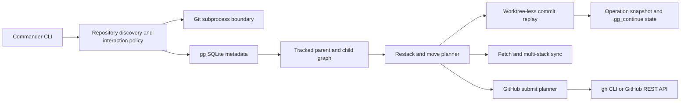

# Architecture and safety model

## End-to-end shape



The CLI finds the repository with `git rev-parse --show-toplevel`, so every command works from nested directories. The configured trunk and durable branch relationships come from files in the repository's common Git directory, not from branch naming or guessed commit ancestry.

## Runtime choices

TypeScript keeps the ref/metadata/recovery state shapes explicit in a command that can rewrite history. Node ESM provides a portable executable runtime, native subprocess and filesystem APIs, and—starting with the required Node 22.13—built-in `node:sqlite`, so the gg database needs no native addon. npm supplies the executable mapping, reproducible lockfile, packaging, and isolated-install workflow with little project-specific machinery.

## Modules

- `src/git.ts` is the only Git subprocess boundary. Arguments are arrays; shell interpolation is never used.
- `src/metadata.ts` creates and updates gg's SQLite schema and JSON configuration files.
- `src/graph.ts` validates and traverses the tracked branch graph.
- `src/restack.ts` previews commits with `merge-tree`, recreates clean commits with `commit-tree`, and manages conflict recovery.
- `src/github.ts` resolves GitHub remotes and implements authenticated `gh` and token transports.
- `src/commands/*` contains presentation and command orchestration.

## Worktree-less restacking

For a tracked branch, `parent_branch_revision` is the old base and the current parent head is the new base. Each branch commit is replayed oldest-first:

```text
git merge-tree --write-tree --messages --merge-base=<old-parent> <new-parent> <commit>
git commit-tree <result-tree> -p <new-parent>
```

The recreated commit preserves author name, email, time, timezone, and message. Git supplies a new committer identity and time, as it does during a rebase. `commit-tree` is called even when the tree is unchanged, so commits that become empty remain present.

No branch ref changes until every commit in that branch previews cleanly. Replay reads an immutable captured branch OID and revalidates the parent tip before mutation. Non-current branches move through compare-and-swap `git update-ref`. A checked-out branch is revalidated immediately before `git reset -q --keep`, and staged changes block that operation before mutation.

## Conflicts and recovery

Explicit `restack` and `move` use a durable `.gg_operation_state` in the common Git directory plus per-worktree `.gg_continue` state. The common sidecar is created exclusively, so linked worktrees cannot begin overlapping `gg` mutations. It captures:

- every local branch ref;
- every `branch_metadata` row;
- the original checked-out branch;
- the pending branch queue and move-parent changes;
- accepted pre-step and planned post-step ref/metadata states;
- the owning worktree Git directory;
- the exact command and an event ID.

When preview detects a conflict, `gg` checks that the worktree is clean, checks out the affected branch, and invokes a normal `git rebase --onto`. Git owns the index and conflict files. `gg continue` advances that rebase and resumes the saved queue. `gg abort --force` calls `git rebase --abort`, restores captured refs and metadata, and returns to the original branch. Recovery refuses to overwrite a ref or topology changed outside the recorded operation, including an externally deleted branch.

Before a clean step mutates a ref or SQLite, the journal durably records both the current accepted state and the complete planned post-step state. Reparenting plus branch/base revision updates occur in one SQLite transaction. A restart can therefore distinguish a crash before the step from a crash after it and safely restore/replay the command. Commit-propagation and sync's warn-and-skip policy use the same per-branch journal path.

`commit create` and `commit amend` deliberately use a different conflict policy: the commit succeeds, clean descendants are replayed, and the first conflicting descendant remains untouched with a warning. No live rebase is left behind. `sync` similarly warns, skips the failed subtree, and proceeds with independent stacks.

## Submission transaction boundary

Submission performs all read-only validation first: repository, authentication, scope, restack state, and existing-PR uniqueness. It then applies each branch bottom-up:

1. inspect the exact remote branch OID;
2. push normally when possible;
3. require explicit authorization for a non-fast-forward update and use a pinned `--force-with-lease`;
4. create or update the branch's PR;
5. discover open PRs across every tracked branch and create or update one managed stack comment on each PR;
6. record the submitted commit only after the PR operations and stack-comment refresh succeed.

A later failure can leave already-completed lower branches submitted. The output makes this visible, and rerunning is idempotent because PRs are selected by exact head branch and existing open PRs are updated rather than duplicated.

Stack comments are rebuilt by connected root stack after every successful submission. Each comment links every open PR in bottom-to-top graph order and bolds the PR on which the comment appears. A hidden marker lets `gg` update a stale comment in place or recreate a missing one, so any stack-member push self-heals the connected stack. Adding an upstack branch or moving branches between roots refreshes both the old and new stack without accumulating bot comments. If a later operation fails after at least one push succeeds, `gg` still attempts the repair before reporting the original submission error. Legacy `Stacked branch`/`Base` metadata is removed from PR descriptions on the next ordinary description update while any following human-authored description is preserved.

Before GitHub authentication, an ordinary submit compares every selected local head with its last submitted version and verifies that the stored parent revision is still current. If all match, it exits with one unchanged-status line and performs no remote or metadata operations. Options that request an explicit GitHub or presentation action bypass this fast path.

## Trace-free local installation

`make install` copies the current source into an owned temporary directory, runs the locked build there with an isolated npm home/cache/config, packages it, and installs only the runtime package under `~/.local/share/gg`. Every run replaces an existing managed installation so local development updates take effect. The replacement is staged and validated before the previous package is swapped out; failures restore the previous package. The user-facing `~/.local/bin/gg` is created only after the staged executable passes `--help` validation. An exclusive ownership-marked lock serializes install operations, and signal/failure handlers remove owned staging trees.

`make uninstall` verifies both the installation manifest and executable symlink before deleting anything. It removes the dedicated prefix, link, stale ownership-marked staging directories, lock, and installer-created directories only when they are empty. Pre-existing directories are retained. Installation intentionally replaces an existing file or symlink only at the exact `~/.local/bin/gg` executable path; an unrecognized package directory is never replaced.

This trace-free guarantee covers files created by installation. Stack metadata written inside repositories and credentials managed by Git or `gh` are user data and remain untouched.

## Safety invariants

- Never merge or push directly to trunk.
- Never use `git reset --hard`, `git clean`, or an unleased forced push.
- Reject cycles and self-parenting before mutation.
- Never infer the durable stack solely from commit ancestry.
- Refuse a conflict-materializing rebase when unrelated worktree changes would be at risk.
- Preserve staged changes when a checked-out restack is rejected.
- Serialize ref/metadata mutation across linked worktrees.
- Store credentials only in the user's existing Git/`gh` mechanisms; never persist or print tokens.
